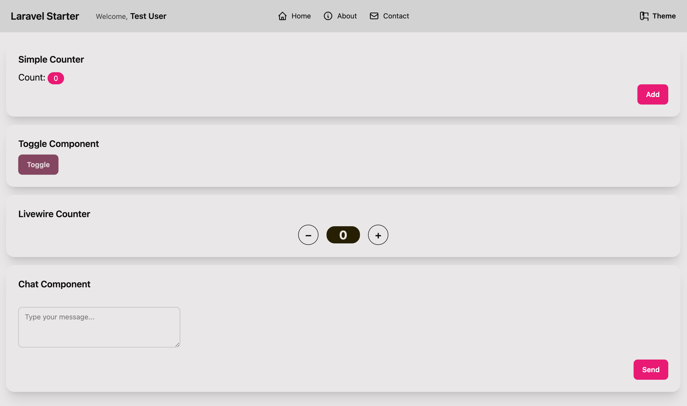

# Laravel Livewire Alpine Starter

[](https://laravel.com/)
[](https://livewire.laravel.com/)
[](https://alpinejs.dev/)
[](https://tailwindcss.com/)
[](https://daisyui.com/)
[](https://www.postgresql.org/)
[](https://vitejs.dev/)



---

This starter kit provides a quick foundation for building Laravel apps, emphasizing a straightforward development experience with **Livewire** and **Alpine.js**. It uses **TailwindCSS 4** with **DaisyUI** for UI components, all bundled with **Vite**.

Unlike some other starter kits, because I'm opinonated against x-layout x-component this and that that the current official laravel starter kit comes with. Hundreds of files. This project intentionally avoids complex frontend frameworks like Flux and adheres to **traditional Blade layouts** using `@extends('layouts.app')` and `@section('content')` for simplicity and familiarity. Just go. Fast.

## Features

* **Laravel 12**: The latest version.
* **Livewire 3**: For extra dynamic stuff, or SEO stuff since dynamic things with alpine isnt.
* **Alpine.js**: You can do everything, everything, with Alpine, why complicate things with React?.
* **PostgreSQL**: Or Supabase.
* **TailwindCSS 4**: No brainer.
* **DaisyUI**: Makes things a bit cleaner and easier.
* **Vite**: Default.
* **Traditional Blade Layouts**: I've been using Laravel for too long.

---

## Getting Started

Setup reminder:

### Installation Steps

1.  **Clone the Repository:**
    ```bash
    git clone [https://github.com/your-username/laravel-livewire-alpine-starter.git](https://github.com/your-username/laravel-livewire-alpine-starter.git)
    cd laravel-livewire-alpine-starter
    ```

2.  **Environment Configuration:**
    ```bash
    cp .env.example .env
    ```

3.  **Install PHP Dependencies:**
    ```bash
    composer install
    ```

4.  **Generate Application Key:**
    ```bash
    php artisan key:generate
    ```

5.  **Database Setup:**
    First create database.sqlite. Only switch out to pgSQL when you need to.
    ```bash
    php artisan migrate --seed
    ```

6.  **Frontend Dependencies:**
    ```bash
    npm install
    ```

7.  **Build Assets:**
    ```bash
    npm run build
    ```

Visit the site in your web browser. (I use Herd)

---

## Architecture Overview

---

## Code Quality & Development

### Code Formatting

To ensure consistent code style, use Laravel Pint:

```bash
./vendor/bin/pint