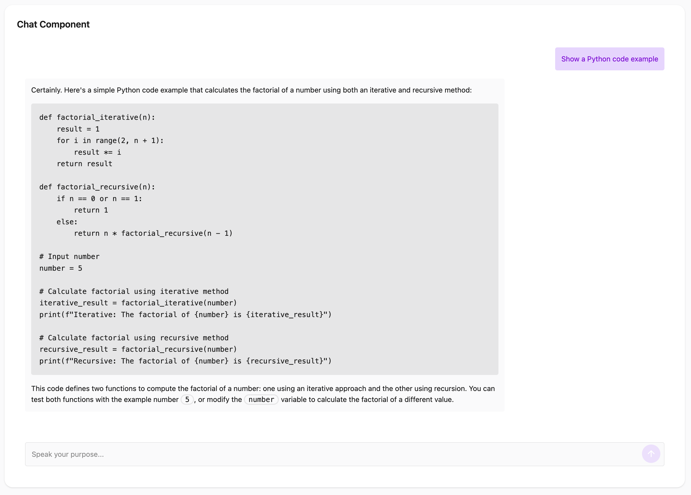

# Laravel Livewire Alpine Starter

[](https://laravel.com/)
[](https://livewire.laravel.com/)
[](https://alpinejs.dev/)
[](https://tailwindcss.com/)
[](https://daisyui.com/)
[](https://www.postgresql.org/)
[](https://vitejs.dev/)




---

This starter kit provides a quick foundation for building Laravel apps, emphasizing a straightforward development experience with **Livewire** and **Alpine.js**. It uses **TailwindCSS 4** with **DaisyUI** for UI components, all bundled with **Vite**.

Unlike some other starter kits, because I'm opinonated against x-layout x-component this and that that the current official laravel starter kit comes with. Hundreds of files. This project intentionally avoids complex frontend frameworks like Flux and adheres to **traditional Blade layouts** using `@extends('layouts.app')` and `@section('content')` for simplicity and familiarity. Just go. Fast.

Has a working theme switcher with DaisyUI.
Theme choice saves to user record in database. Page switching with wire:navigates works and preservs theme selection.

Has AI functionality with openai-php/client and OpenRouter with a demo chat wrapper.

## Features

* **Laravel 13**: The latest version.
* **Livewire 3**: For extra dynamic stuff, or SEO stuff since dynamic things with alpine isnt.
* **Alpine.js**: You can do everything, everything, with Alpine, why complicate things with React?.
* **PostgreSQL**: Or Supabase.
* **TailwindCSS 4**: No brainer.
* **DaisyUI**: Makes things a bit cleaner and easier.
* **Vite**: Default.
* **Traditional Blade Layouts**: I've been using Laravel for too long.

---

## Getting Started

### Preferred: Laravel Installer

This is the recommended Laravel starter kit flow. The package must be published on Packagist as `operatorr/laravel-starter-kit`.

```bash
composer global require laravel/installer
laravel new my-app --using=operatorr/laravel-starter-kit
cd my-app
npm install
npm run build
composer run dev
```

The Composer post-create scripts copy `.env`, generate `APP_KEY`, create `database/database.sqlite`, run migrations, and seed the starter user.

### Classic: Composer Create Project

```bash
composer create-project operatorr/laravel-starter-kit my-app
cd my-app
npm install
npm run build
composer run dev
```

### Local Development From Git

Use this when working on the starter kit itself before it has been published to Packagist, or when testing unpublished changes.

```bash
git clone https://github.com/Operatorr/laravel-starter-kit.git my-app
cd my-app
composer install
cp .env.example .env
php artisan key:generate
touch database/database.sqlite
php artisan migrate --seed
npm install
npm run build
composer run dev
```

### Publishing Checklist

Both `laravel new --using=operatorr/laravel-starter-kit` and `composer create-project operatorr/laravel-starter-kit my-app` depend on the same Packagist package.

1. Push this repository to GitHub.
2. Submit `https://github.com/Operatorr/laravel-starter-kit` to Packagist.
3. Tag a stable release, for example `v1.0.0`, so Composer can install it without requiring a dev constraint.
4. Keep the `composer.json` package name as `operatorr/laravel-starter-kit`.

Visit the site in your web browser. (I use Herd)

---

## Architecture Overview

---

## Code Quality & Development

### Code Formatting

To ensure consistent code style, use Laravel Pint:

```bash
./vendor/bin/pint
